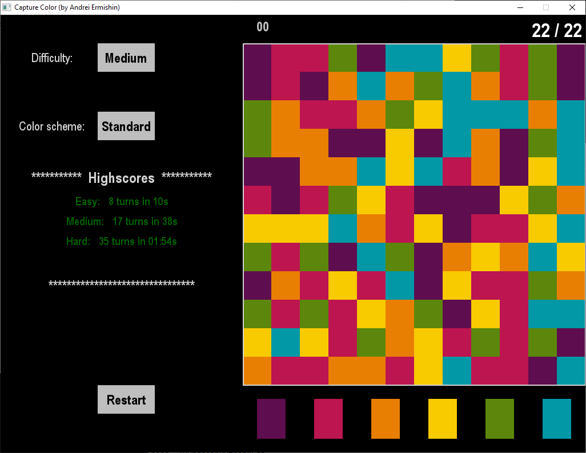

# capture-color
:video_game: Small game on Pygame in which you need to turn different colors to one by merging adjacent cells.

  

## Author

**Andrei Ermishin**

## License

See [LICENSE](LICENSE) for more information.

Copyright 2020 © Andrei Ermishin
